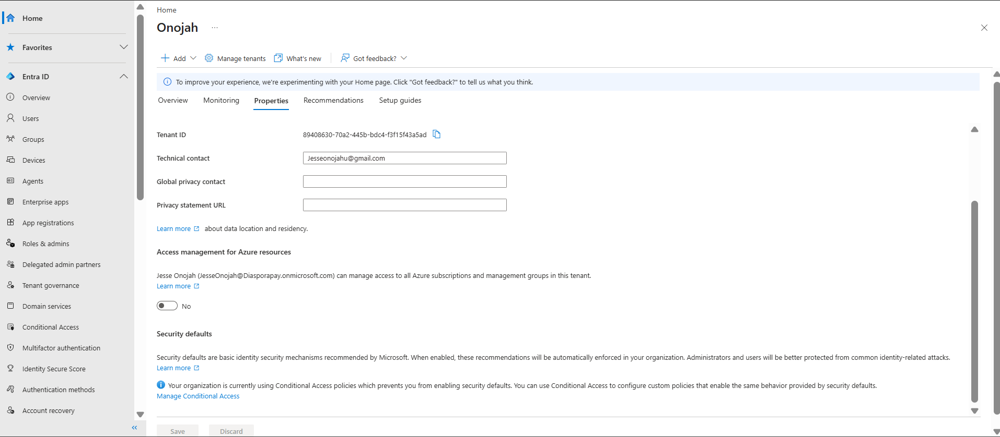
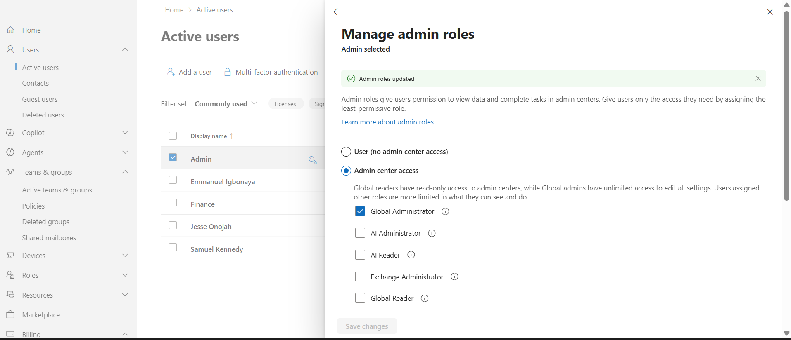
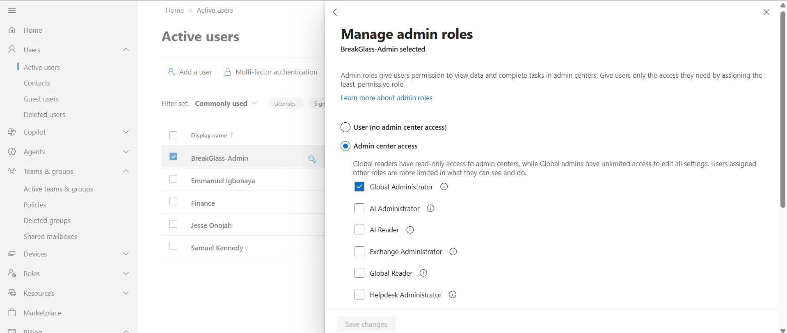
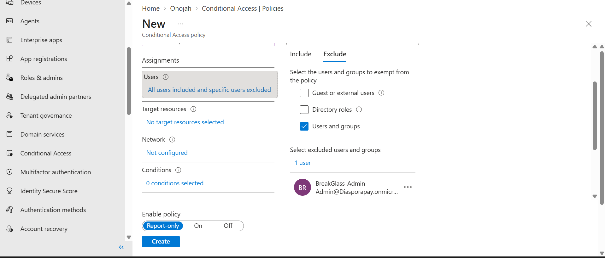
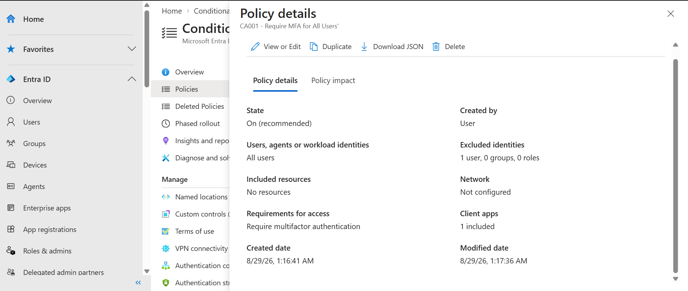
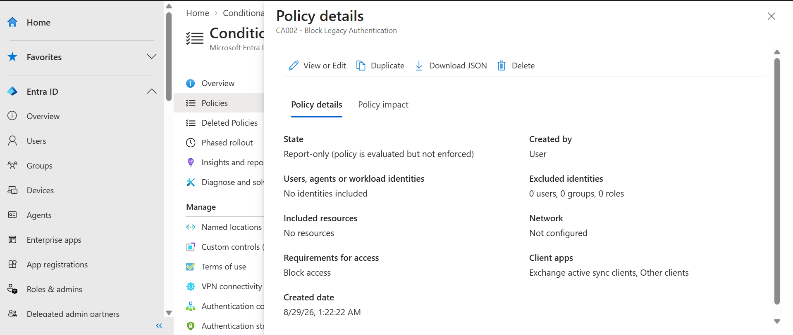
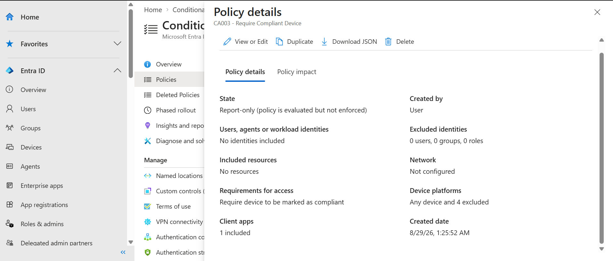
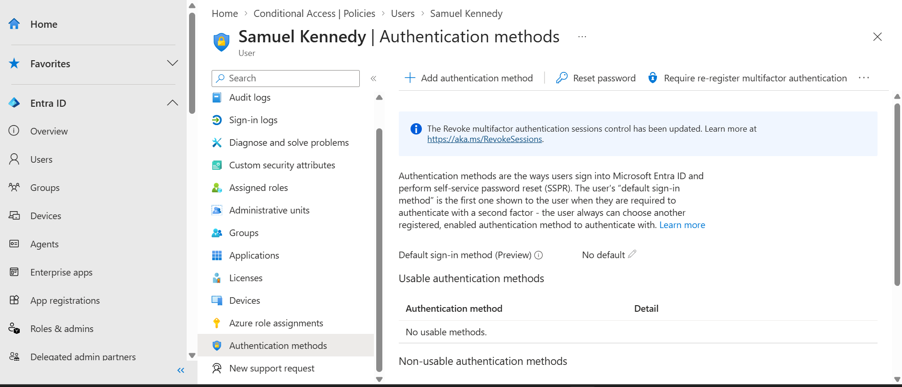
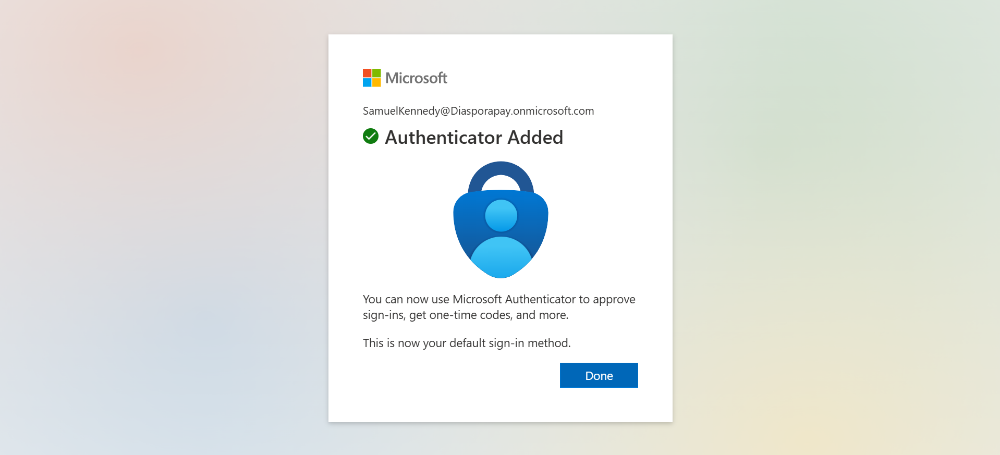
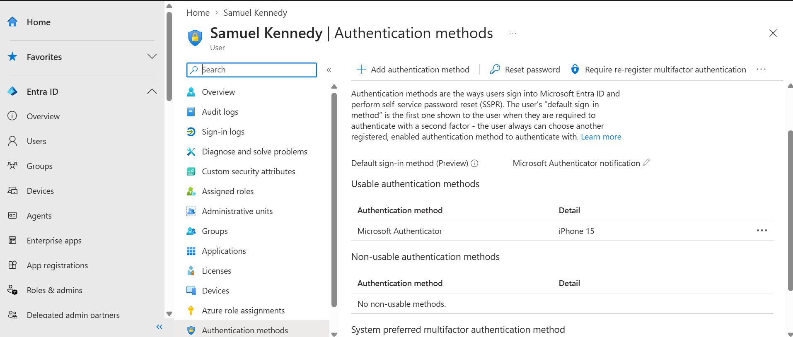

# 02 — Entra ID, MFA & Conditional Access

## Objective
Harden identity and access using Microsoft Entra ID: enforce MFA, block legacy authentication, and gate access on device compliance — while protecting against tenant lockout with a break-glass account.

## Steps Taken

**1. Security Defaults**
Checked **Entra ID > Properties > Security defaults**. Since custom Conditional Access policies were being built instead of relying on the baseline, Security Defaults was left disabled — Entra ID confirms it cannot be re-enabled while Conditional Access policies are active, which was the intended outcome.

**2. Break-glass (emergency access) account**
Before enabling any access-restricting policies, created a dedicated emergency access account:
- `BreakGlass-Admin` (Admin@Diasporapay.onmicrosoft.com)
- Assigned the **Global Administrator** role directly
- Deliberately **not** registered for MFA, using a long random password instead — standard emergency-access practice, so a single point of failure (MFA method, Conditional Access misconfiguration) can't lock out all tenant admins
- Excluded from every Conditional Access policy below

**3. Conditional Access policies**
Built three policies under **Protection > Conditional Access > Policies**:

| Policy | State | Applies To | Effect |
|---|---|---|---|
| **CA001 – Require MFA for All Users** | **On** | All users (1 excluded: BreakGlass-Admin) | Requires multifactor authentication to sign in |
| **CA002 – Block Legacy Authentication** | Report-only | Exchange ActiveSync clients, Other clients | Blocks access from legacy auth protocols |
| **CA003 – Require Compliant Device** | Report-only | Any device (4 platforms excluded: macOS, iOS, Android, Linux) | Requires the device to be marked compliant in Intune |

CA002 and CA003 were deliberately left in **Report-only** mode initially rather than switched straight to On:
- CA002 needs monitoring first to confirm no legitimate legacy clients would be broken
- CA003 couldn't be safely enforced until Intune compliance policies existed and at least one device was verified compliant (see `03-intune.md`) — enforcing it early would have locked out every device in the tenant, break-glass account aside

**4. MFA registration**
Registered Samuel Kennedy for MFA by signing in as the user and completing Microsoft Authenticator enrolment (linked to a personal phone for testing).

Before registration, the account showed no usable authentication methods:

Confirmed via the "Authenticator Added" success screen shown to the user:

...and the admin-side Authentication methods view, showing Microsoft Authenticator (iPhone 15) listed as a usable method and set as the default sign-in method:

## Notes
Rolling out access-restricting policies in Report-only mode before enforcing them is standard real-world practice — it avoids breaking access for legitimate users while still giving visibility into what a policy *would* have done.
