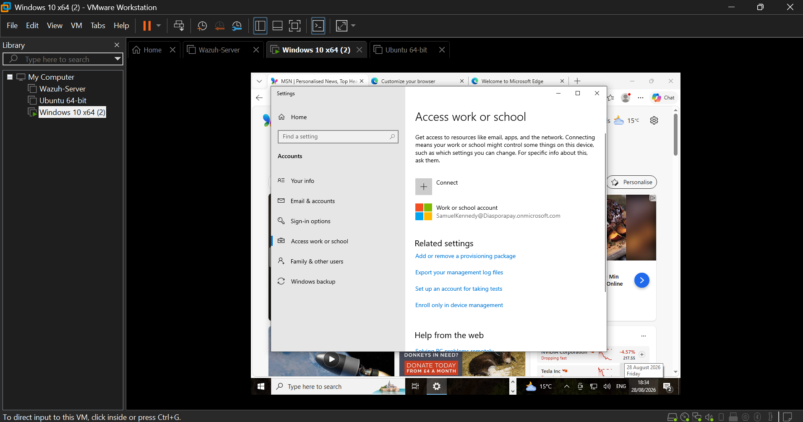
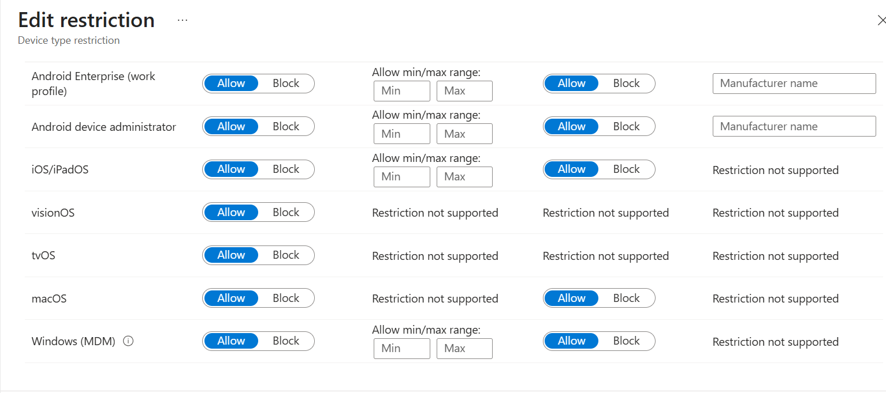
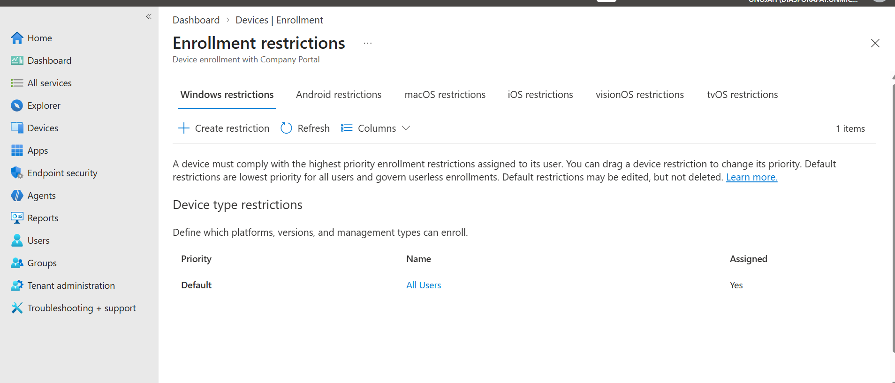
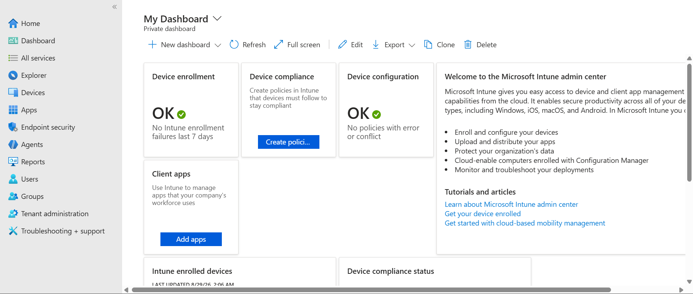
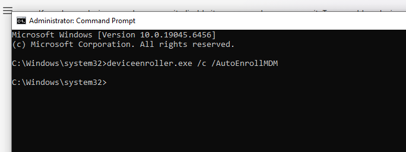
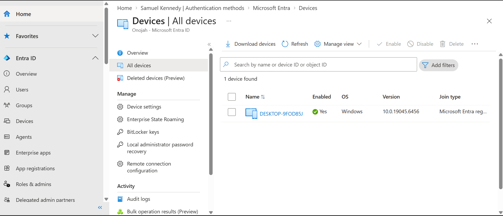
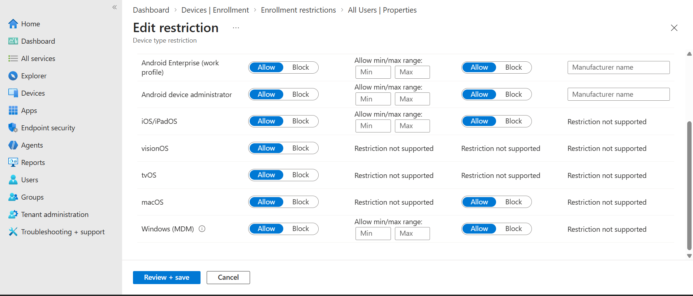
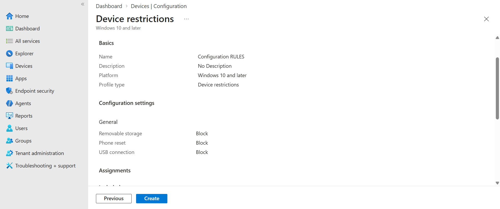
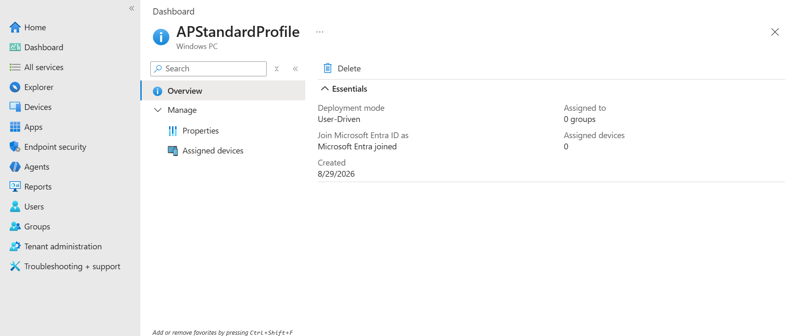

# 03 — Intune Device Management

## Objective
Configure device enrolment, compliance, and configuration policies in Microsoft Intune, and close the loop with the Conditional Access "Require Compliant Device" policy from `02-entra-id-mfa-ca.md`.

## Steps Taken

**1. Enrolment prerequisites**
Verified two settings under **Devices > Enrollment > Windows** before attempting any device join:
- **Automatic Enrollment** — MDM user scope set to **All**
- **Enrollment device platform restrictions** — Default policy confirmed with Windows (MDM) set to **Allow**




**2. Windows Autopilot deployment profile**
Created a deployment profile named **APStandardProfile** under Windows Autopilot > Deployment profiles:
- Deployment mode: User-Driven
- Join type: Microsoft Entra joined
- Not assigned to real hardware, since no OEM-registered Autopilot device was available in this lab — in production this profile would be assigned to devices registered via hardware hash upload from the OEM or reseller.



**3. Device enrolment**
Enrolled a Windows 10 virtual machine (VMware Workstation) by signing in with a test user account (Samuel Kennedy) via **Settings > Accounts > Access work or school**.



The device initially connected to Entra ID but did not immediately trigger full MDM enrolment. Resolved by manually forcing the enrolment task from an elevated command prompt on the device:

```
deviceenroller.exe /c /AutoEnrollMDM
```



The device (`DESKTOP-9FOD85J`) subsequently appeared under **Entra ID > Devices > All devices**, confirming successful Microsoft Entra registration and MDM enrolment.



**4. Compliance policy**
Created **Win10-Compliance-Baseline** under Devices > Compliance > Policies (Windows 10 and later).



**5. Configuration profile**
Created a Device restrictions profile named **Configuration RULES** (Windows 10 and later) with the following settings under General:
- Removable storage: **Block**
- Phone reset: **Block**
- USB connection: **Block**



Intune dashboard confirming no enrolment failures or configuration conflicts:



## Troubleshooting Note
The VM's MDM enrolment did not complete automatically after joining Entra ID — a known limitation with some virtualised environments where the background auto-enrolment task doesn't fire immediately. Running `deviceenroller.exe /c /AutoEnrollMDM` manually on the device resolved it. This is documented here deliberately: real-world Intune administration frequently involves this exact troubleshooting step when devices fail to appear after joining.
