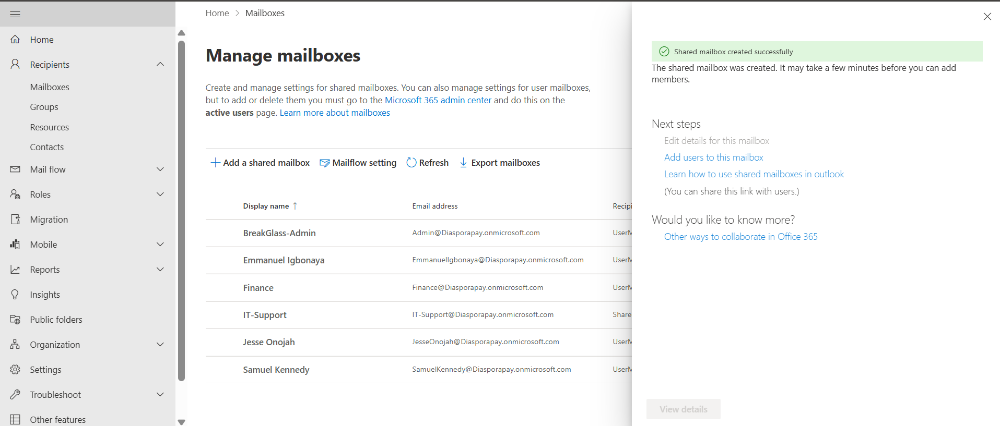
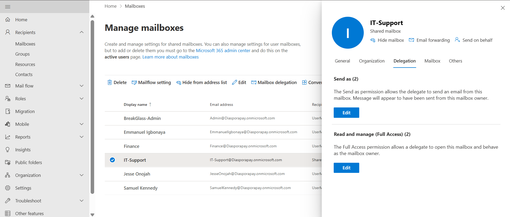
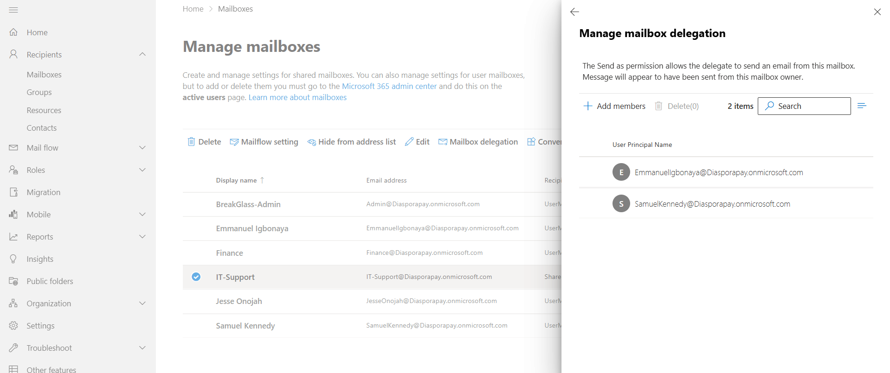
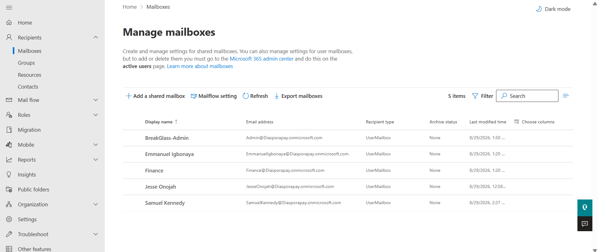
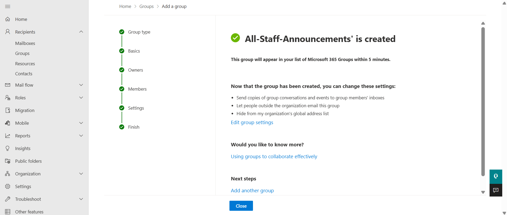
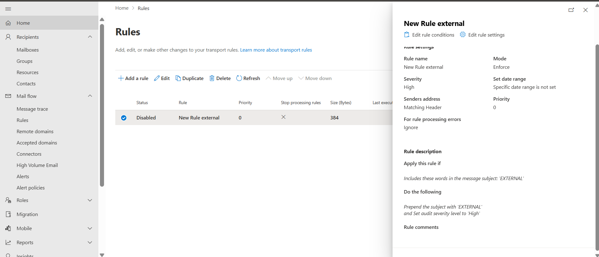
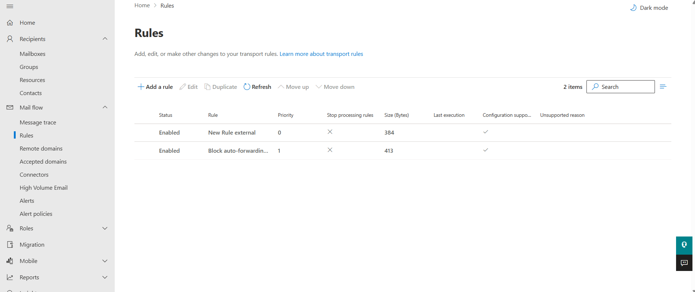

# 04 — Exchange Online: Mailboxes, Groups & Mail Flow Rules

## Objective
Configure shared mailbox delegation, a distribution group, and mail flow (transport) rules to demonstrate messaging governance and security controls.

## Steps Taken

**1. Shared mailbox**
Created a shared mailbox, **IT-Support** (IT-Support@Diasporapay.onmicrosoft.com), via **Exchange admin centre > Recipients > Mailboxes**.

Delegated access configured under the mailbox's **Delegation** tab:
- **Send as**: Emmanuel Igbonaya, Samuel Kennedy
- **Read and manage (Full Access)**: Emmanuel Igbonaya, Samuel Kennedy

Full mailbox list, including the break-glass account and all test users:

**2. Distribution group**
Created **All-Staff-Announcements**, a Microsoft 365 group, with all test users (Emmanuel Igbonaya, Finance, Jesse Onojah, Samuel Kennedy) added as members and Jesse Onojah as owner.

**3. Mail flow rules**
Two transport rules created under **Mail flow > Rules**, both confirmed **Enabled**:

| Rule | Condition | Action |
|---|---|---|
| **New Rule external** | Sender is external/internal → sender located outside the organization | Prepend the subject with `[EXTERNAL]`; set audit severity to High |
| **Block auto-forwarding** | Recipient is outside the organization; message type is auto-forward | Reject/block the message |

Both rules confirmed live and enabled:

The external-sender rule was also configured with an append-disclaimer variant, adding the message:
> "CAUTION: This email originated from outside the organisation. Do not click links or open attachments unless you recognise the sender and know the content is safe."

## Notes
Blocking auto-forwarding to external domains is one of the most commonly requested real-world mail flow controls, since it closes a well-known channel for data exfiltration via compromised mailboxes.
