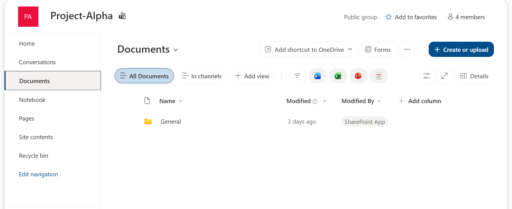
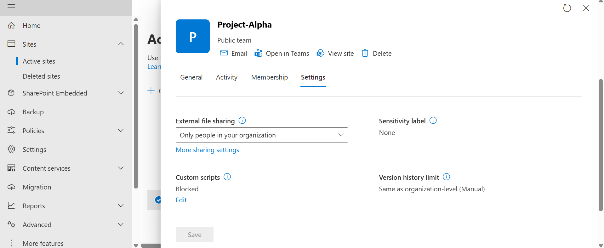
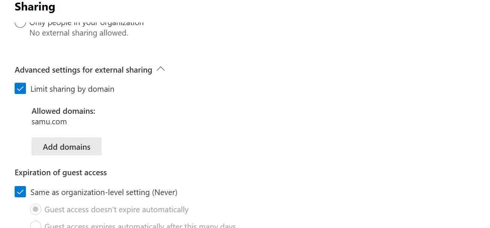

# 05 — SharePoint & Teams Governance (Partial)

## Objective
Configure SharePoint site permissions/sharing and Microsoft Teams governance policies for the Project-Alpha collaboration space created in `01-tenant-setup.md`.

## Status: In Progress

This section was partially completed. SharePoint site configuration is documented below; Teams meeting and messaging policy configuration is outstanding and noted as a next step.

## Steps Taken

**1. SharePoint site**
The **Project-Alpha** Microsoft 365 group automatically provisioned a linked SharePoint team site with a Documents library.

**2. External sharing**
Configured under **SharePoint admin centre > Active sites > Project-Alpha > Settings**:
- External file sharing set to **Only people in your organization**
- Custom scripts: **Blocked**
- Version history limit: Same as organization-level (Manual)

**3. Domain-restricted sharing**
Configured under the tenant-level sharing settings:
- **Limit sharing by domain** enabled
- Allowed domain: `samu.com`

## Outstanding

- Microsoft Teams meeting policy (e.g. disabling anonymous join, requiring a lobby for external participants)
- Microsoft Teams messaging policy (e.g. restricting message edit/delete for standard users)
- Verifying the Teams team auto-created alongside the Project-Alpha group

## Notes
Documenting an in-progress section honestly, rather than fabricating completed Teams policies, better reflects how real projects are tracked and handed off.
